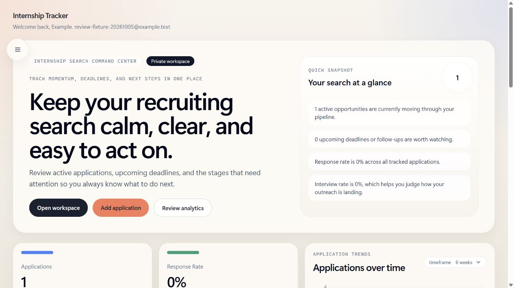

# Internship Tracker

A student application tracker for keeping companies, roles, deadlines, and recruiting progress in one place.

## Current status

The app runs locally with Node.js 24 and PostgreSQL 16. There is no published demo URL. Deployment requires a hosting account, PostgreSQL, authentication secrets, and a verified email sender. See the [deployment guide](docs/deployment-guide.md).

The dashboard screenshot below comes from a local production build using a disposable test account and synthetic application. The [shot list](docs/screenshot-shotlist.md) covers additional screens. No open-source license has been selected.



[View the login screen](docs/screenshots/login.png).

## Functionality

- Credentials signup/login, password confirmation, and email password recovery.
- Eight application statuses, board/table views, search, filters, sorting, and quick status changes.
- One optional contact per application, a single notes string, tags, deadlines, salary text, job links, and a resume-version label. No resume files are uploaded.
- Dashboard charts, analytics timeframes, a priority queue, and a replayable introductory tour.
- User-scoped records and database readiness at `/api/health`.

## Architecture and tradeoffs

Next.js 16 App Router serves pages and server actions. React 19, TypeScript, and Tailwind CSS 4 handle presentation; Recharts renders analytics. Authenticated server actions access PostgreSQL through Prisma 7 and its pg adapter. NextAuth v4 credentials login uses bcrypt password hashes and JWT sessions. Reset tokens are hashed in the database and claimed atomically before changing a password. Resend sends recovery emails from the server.

Users own applications and tags. Each application has at most one contact and a many-to-many tag relation. Notes remain a string to keep editing straightforward. Analytics load all of a user's applications, which is simple for an individual search but unsuitable for unlimited datasets.

JWT sessions avoid a session table, but existing sessions are not automatically revoked on password reset. The process-local limiter does not coordinate across serverless instances. Public signup is therefore off by default in production; enabling it requires shared abuse controls.

## Run from a clean checkout

Prerequisites: Node.js 24, pnpm 10.34.6, Docker Desktop (or PostgreSQL 16), and Git. The pnpm version is pinned in `package.json`.

```sh
git clone https://github.com/YangOwen007/Internship-Tracker.git
cd Internship-Tracker
cp .env.example .env
pnpm install --frozen-lockfile
pnpm db:postgres:up
pnpm db:generate
pnpm db:migrate:deploy
pnpm dev
```

In PowerShell, use `Copy-Item .env.example .env` instead of `cp`. Generate an auth secret with `node -e "console.log(require('node:crypto').randomBytes(32).toString('hex'))"` and put it in the untracked `.env`. Open [localhost:3000](http://localhost:3000), create an account, and add applications. Default database credentials are for the loopback-only local container.

`pnpm db:seed` and `pnpm db:setup` delete existing data. Use them only with disposable local databases; set `SEED_DEMO_PASSWORD` privately for a known demo password. No seed password is logged. Production and non-loopback targets require an explicit destructive override.

## Environment

See [`.env.example`](.env.example). Keep real values out of Git.

| Variable | Purpose |
| --- | --- |
| `DATABASE_URL` | PostgreSQL connection; managed database for deployment |
| `NEXTAUTH_SECRET` | Strong random signing secret; never use the example |
| `NEXTAUTH_URL` | Canonical origin; HTTPS for public deployments |
| `RESEND_API_KEY`, `RESEND_FROM_EMAIL` | Production recovery email and verified sender |
| `PUBLIC_SIGNUP_ENABLED` | Defaults on locally, off in production |
| `SEED_DEMO_PASSWORD` | Optional known password for disposable seeds |

Without Resend locally, recovery displays a browser preview link. Do not expose a development server publicly: that link grants password-reset access.

## Verification

```sh
pnpm lint
pnpm typecheck
pnpm test
pnpm security:scan
pnpm security:audit
pnpm build
```

Tests require local PostgreSQL with migrations applied. They create unique temporary users and clean up their own records. Coverage includes helper validation, tenant-scoped updates, and reset-token reuse/concurrency. `pnpm security:scan -- --history` checks selected credential formats in Git history without printing matches. It is not exhaustive.

CI installs the frozen lockfile, generates Prisma, migrates a disposable PostgreSQL service, and runs these checks. It does not seed or deploy. Dependabot proposes dependency updates.

The full audit currently reports one development-only high advisory in `braces` through Next.js lint tooling, with no published patched version. CI reports that tooling advisory without suppressing it; production dependency auditing remains a blocking check.

## Production execution

```sh
pnpm install --frozen-lockfile
pnpm db:generate
pnpm db:migrate:deploy
pnpm build
pnpm start
```

Configure production variables first. Run migrations once as a release step. Readiness returns 200 when PostgreSQL is reachable and 503 otherwise; it does not test email delivery. See the [deployment guide](docs/deployment-guide.md) for platform setup, backups, rollback, and smoke checks.

## Known limitations

- Distributed login/signup/recovery abuse protection remains an operator responsibility.
- Session revocation, email verification, account deletion, and automated retention are not implemented.
- The dashboard lacks server-side pagination.
- Browser end-to-end and automated accessibility coverage are incomplete.
- No release tag, hosted demo, or uptime monitoring is configured; screenshots do not cover every screen.
- Public visibility does not grant an open-source license.

The project explores relational modeling, authorization, transactions, auth recovery, dashboard state, and repeatable release checks. See [SECURITY.md](SECURITY.md) for reporting and operational notes.
